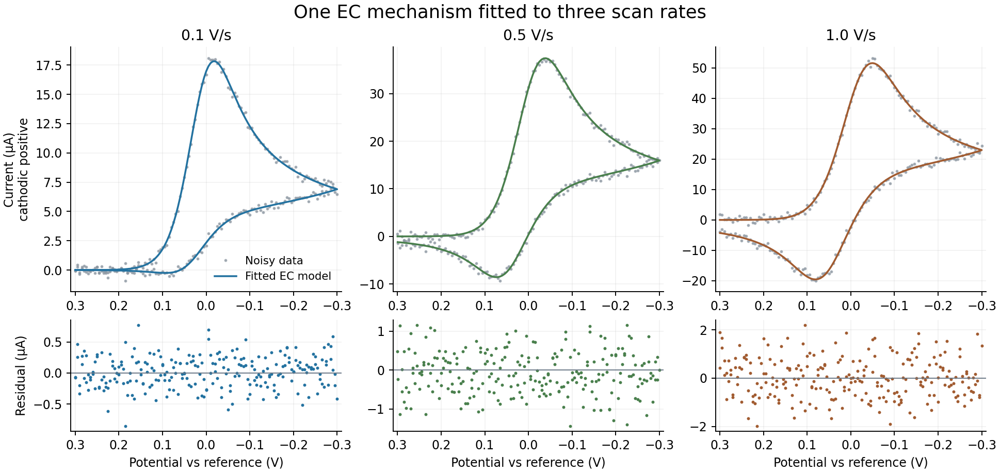

# EC: a complete website walkthrough

Use [EchemLab](https://colegruninger.com/Echem_Simulator/) to follow one study from a forward simulation to parameter estimation, mechanism comparison, and uncertainty. No programming or Julia is needed.

This example uses **synthetic, noisy data**, not experimental measurements. It is a reproducible teaching and regression example, not evidence that every mechanism or uncertainty interval is validated for real electrodes.

## 1. What are we modeling?

```text
Ox + e− ⇌ Red       Butler–Volmer electron transfer at the electrode
Red → Product      homogeneous first-order conversion, rate = k[Red]
```

All three species diffuse in solution. The working assumptions are planar, one-dimensional diffusion, excess supporting electrolyte, a quiescent solution, and a distant bulk boundary. The electrode exchanges electrons with Ox/Red; Product is electroinactive. There is no adsorption, enzyme, finite closed strip volume, or convection in this example.

The three reaction–diffusion equations are:

```text
∂[Ox]/∂t      = D ∂²[Ox]/∂x²
∂[Red]/∂t     = D ∂²[Red]/∂x² − k[Red]
∂[Product]/∂t = D ∂²[Product]/∂x² + k[Red]
```

Butler–Volmer kinetics supply the Ox/Red electrode fluxes. Product has zero electrode flux. Changing the applied potential program gives either CV or chronoamperometry with the same chemistry.

## 2. Load the mechanism and simulate

Download [ec_start.json](ec_start.json) and the three data files: [0.1 V/s](ec_0.1Vs.csv), [0.5 V/s](ec_0.5Vs.csv), [1.0 V/s](ec_1.0Vs.csv). These are also linked under **Reference → Worked EC example** on the website.

1. Open **Simulate → Import JSON** and select `ec_start.json`.
2. Check that the species are Ox, Red, and Product, with one solution electron-transfer reaction and one homogeneous mass-action reaction. Keep supported-electrolyte transport.
3. Enter these experiment conditions:

| Control | Value |
| --- | ---: |
| Technique | Cyclic voltammetry |
| Initial potential | +0.30 V |
| Switching potential | −0.30 V |
| Scan rate | 0.50 V/s |
| Temperature | 298.15 K |
| Electrode area | 0.070 cm² |
| Solution resistance, Ru | 0 Ω |
| Double-layer capacitance, Cdl | 0 μF/cm² |
| Time integrator | Fixed-step fully implicit BDF2 |

The JSON supplies 0.001 M Ox, zero Red/Product, and D = 0.00001 cm²/s for every species. **Importing a mechanism does not import these waveform or electrode conditions.**

Click **Simulate**. Review the numerical-resolution report. Save traces explicitly if you want to compare different scan rates or rate constants. The imported starting values deliberately differ from the data-generating values: this first curve is an initial guess, not the eventual fit.

The scan starts positive of E⁰ and moves negative, reducing Ox. The chemical step consumes Red, reducing its availability for oxidation on the return scan. Changing the scan rate changes how much time that conversion has to occur.

## 3. Import and check the data

1. Open **Fit data**. Confirm the shared-conditions summary still shows area **0.070 cm²**, temperature **298.15 K**, and zero Ru/Cdl.
2. Choose all three CSV files together. Each file contains one complete CV, with 241 observations.
3. Set **Charging-current treatment → None — corrected data or explicit circuit model**. These synthetic currents have no charging background or file offset.
4. For every data card, check CV, scan rate 0.1/0.5/1.0 V/s, and the import normalization: time in **s**, potential in **V**, current in **A**, **As recorded**, reference shift **0 V**. Leave species overrides empty so all three files use the model's shared initial concentrations.
5. Resolve any blocking data errors, then choose **Continue to parameter selection**.

The model's stored current convention is **cathodic positive**. These CSVs already use it. For an instrument exporting anodic-positive current, select **Invert sign** during import. Changing the plot's U.S./IUPAC display convention does not correct the imported data.

For a real experiment, use a consistent reference electrode/potential offset and known area, concentration, temperature, Ru, and diffusion coefficients. An incorrect area or concentration can be absorbed into fitted kinetics. Compare blank measurements and choose the background treatment deliberately; do not let a flexible background compensate for missing chemistry.

## 4. Estimate three unknowns together

Select only these three **Estimate** checkboxes (the supplied JSON preselects them):

| Parameter | Starting value | Lower bound | Upper bound | Meaning |
| --- | ---: | ---: | ---: | --- |
| Ox / Red · E0 (`r1_E0`) | −0.01 | −0.10 | +0.10 | Formal potential, V |
| Ox / Red · k0 (`r1_k0`) | 0.020 | 0.001 | 0.10 | Electrode rate, cm/s |
| Red to Product · k (`r2_k`) | 0.50 | 0.05 | 10 | Chemical rate, s⁻¹ |

Hold α = 0.5, n = 1, concentrations, and all D values fixed. Leave shared-D fitting off. Fitting every quantity at once is usually not identifiable.

Under **Optimization**, select **Least squares**, **Implicit BDF2**, **3 multistart runs**, **1200 minimum timesteps**, **64 spatial grid points**, and **100 maximum iterations per start**. Click **Estimate selected parameters**. The three experiments are fitted simultaneously to one common parameter vector.

The packaged Rust/WebAssembly run on 2026-10-04 gave:

| Parameter | Generating value | Recovered value |
| --- | ---: | ---: |
| E⁰, V | 0.02000 | 0.020365 |
| k⁰, cm/s | 0.01000 | 0.009793 |
| k, s⁻¹ | 1.500 | 1.4784 |

All three starts converged to one competitive solution; no fit warning triggered. Residual RMS was approximately 1.4–1.6% of peak current, consistent with the added noise. Combined time/grid refinement changed fitted currents by about **0.023%**. Small variation across versions is normal; exact reproduction is less important than convergence, residuals, and numerical checks.



Inspect the overlays and residuals. Broad lobes, drift, or scan-dependent mismatch indicate a model/conditions problem even if the optimizer converged. Check bounds and correlations. A value pressed against a bound is not a well-measured rate constant. Numerical certification checks currents at the fitted point; for demanding work, increase resolution and **refit** to check estimate stability too.

Use **Download calculation record (JSON)** to retain the data, request, and results. This is an analysis record, not an importable saved GUI session. Keep the original files and mechanism JSON as well. Fitting does not overwrite the simulation editor's starting values; copy fitted values there explicitly if you want a new forward run.

## 5. Quantify uncertainty

### Start with a profile

Click **Analyze uncertainty for this fit**, now at the top of the fit result. Select **Red to Product conversion · k (s⁻¹) [r2_k]**, set **11 profile points** and **3 standard errors** for the span, then **Calculate profile**.

At each fixed k, the other selected parameters are reoptimized. A finite interval asks which values remain compatible with these data under the specified model. The verified run gave approximately **1.452–1.505 s⁻¹** for the 95% profile interval. The check used two starts per profile point; the GUI inherits the fit's three, so its final digits can differ.

If the profile only gives a lower/upper limit, or never crosses the threshold, do not report a finite two-sided interval. Expand the profile span; examine bounds and refit warnings. More informative experiments may be needed. This interval remains conditional on the EC mechanism and fixed D, area, concentration, α, and temperature.

### Include uncertainty in a measured condition

In **Measured-input uncertainty**, select **Electrode area**. Enter **0.070 cm²** and **standard uncertainty 0.0014 cm²** (2%, one standard deviation), add it to the list, then **Propagate measured uncertainty**. Use the default 95% level.

This refits at perturbed input values and combines the local contributions. In the verified run, the SE of k increased from **0.01354 to 0.02571 s⁻¹**, and its combined interval was about **1.429–1.530 s⁻¹**. This is distinct from the conditional profile interval. Review the reported nonlinearity; the calculation is a local propagation approximation, assumes independent measured inputs, and is not a full joint Bayesian treatment of all input errors.

Download each result before running the next analysis: the results pane is replaced. Editing the study clears its fit and uncertainty target; refit before continuing.

### Bayesian analysis is optional and needs diagnostics

Expand **Advanced: Bayesian posterior**. Independent Gaussian noise is appropriate for these generated errors; retain bounded uniform priors for this exercise. Try **4 chains**, **1000 warm-up steps**, **1000 retained samples per chain**, proposal scale **1**, and seed **2026**.

Completion alone is not convergence. Inspect R̂, bulk/tail effective sample size, MCSE, noise-parameter diagnostics, and predictive intervals. The interface flags disagreement. Short/default runs can mix poorly; a longer run is only useful if diagnostics improve. Do not quote credible intervals from a poorly mixed run. AR(1) is an optional residual-correlation model, not a correction for a wrong reaction mechanism.

**Verified limitation:** after correcting a noise-proposal scaling problem, this 1,000-sample run gave kinetic R̂ values of approximately **1.015, 1.020, and 1.009**, with bulk ESS **226, 195, and 275**. That is a substantial improvement over the former ESS of 4–5, but some kinetic and noise parameters still fail the website's strict R̂ ≤ 1.01 criterion. Treat these settings as a diagnostic exercise, not a certified Bayesian answer. The profile and measured-input results above are the recommended starting path; longer Bayesian runs must be checked again before reporting them.

## 6. Compare mechanisms

Keep all three files loaded and go to **Discover mechanism → Standard mechanism library**.

1. Set concentration **0.001 M**, D estimate **0.00001 cm²/s**, E⁰ bounds **−0.10 to +0.10 V**, and criterion **AICc**. The EC′ substrate field is unused for the candidates below.
2. Select **E (reversible)**, **E (quasi-reversible)**, **EC**, and **CE** only.
3. Keep the fit's BDF2, 64-point, 1200-step, three-start settings. Library candidates use their own parameterizations; they do not simply compare the three checked parameters from the custom EC fit.
4. Click **Compare standard mechanisms**. Inspect candidate overlays/residuals, score differences, warnings, and observational-equivalence groups. EC should rank first for this dataset.
5. Optionally enable **leave-one-experiment-out predictive validation** and repeat. This costs extra fits; it asks whether a model trained on two experiments predicts the third.
6. Choose **Use model & refit** for a candidate you want to investigate. This replaces the editable setup and immediately refits with the candidate's preserved constraints. Review its parameter choices and bounds; refit again if you change them, then use the same uncertainty workflow. Download the comparison record before this step, because changing the study clears the ranking.

A ranking establishes relative support **among the supplied candidates**, not a unique molecular mechanism. Small score differences or indistinguishable predictions should be reported as ambiguity. Candidate weights are conditional on that candidate set. For a real study, reserve independent conditions/replicates for prediction and look for missing transport, charging, or adsorption physics before adding reactions.

In the verified comparison, EC ranked first. The next candidate, quasi-reversible E, had ΔAICc ≈ 3423; this deliberately clear teaching case strongly distinguishes EC within the tested library. Real experiments often yield much smaller separations. The comparison can take several minutes, especially with predictive validation enabled.

The comparison also warns that quasi-reversible E and CE are indistinguishable from each other at the residual scale. Here that ambiguity concerns two poorly fitting alternatives, not the winning EC model. Read the named groups instead of interpreting a general ambiguity warning as applying to every candidate.

## 7. Other website capabilities

- **Chronoamperometry:** on Simulate, retain the mechanism, select potential-step chronoamperometry, hold at +0.30 V and step to −0.20 V. For example, use 0.1 s quiet time, 3 s step duration, and 0.01 s requested sampling. This predicts the reduction transient followed by conversion of Red. Fit actual time/potential/current traces through Fit data. CV and chronoamperometry must currently be fitted as separate studies. The supplied CSVs are CV data, not chronoamperometry data.
- **Structured species search:** enter actual elemental compositions and charges, then mark reactions Required, Candidate, or Excluded. Review search coverage and stability. This needs chemical knowledge beyond three abstract species labels; it is not an automatic proof of mechanism.
- **Sparse rate law:** use a known electrochemical scaffold, select a homogeneous target step and its possible concentration inputs, and compare a small polynomial library. For this EC example the expected term is proportional to Red. Keep this as an advanced, supervised exercise; coefficients and support depend on the tested experiments and competing terms.
- **Limits:** PNP is forward-only, standard-library/structured searches do not support nonzero circuit elements, and mixed CV/chrono studies are not supported. Search modes have distinct restrictions; follow their availability messages. Enzyme immobilization, strip geometry, and finite-volume boundaries require their own justified model and are not established by this EC tutorial.

## Reproduce the verification in Rust

From the repository root, with the pinned Rust toolchain and Node available:

```sh
cargo run --release --manifest-path browser/Cargo.toml -p electrochem-core --example ec_tutorial
node browser/test_ec_tutorial.mjs
# Optional, longer diagnostic exercise:
node browser/test_ec_tutorial.mjs --posterior-only
```

The native Rust generator checks concentration conservation, nonnegativity, the zero-chemical-rate limit, and numerical refinement. It uses a finer grid/time discretization than the inverse calculation, adds deterministic independent Gaussian noise (1.5% of each clean peak; seed 20261004), and writes the three CSVs plus `generation.txt`. Generation refinement is below 0.016%. The browser check uses the real importer and packaged Rust/WASM fitter, profile, measured-input propagation, and library comparison. Requests and complete outputs go into ignored `examples/output/ec_tutorial/`.

This verifies the integrated workflow for a deliberately tractable EC case. Repeated noise realizations, interval-coverage studies, and controlled real-data benchmarks are still needed for broader scientific claims.
